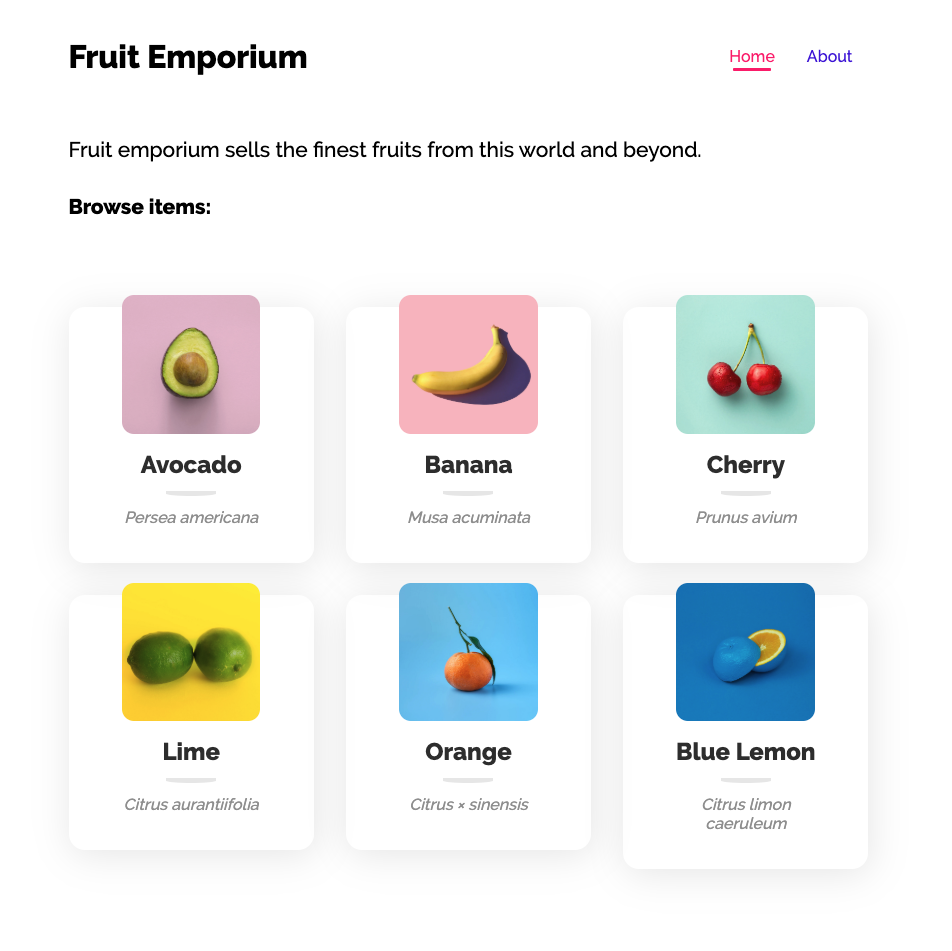
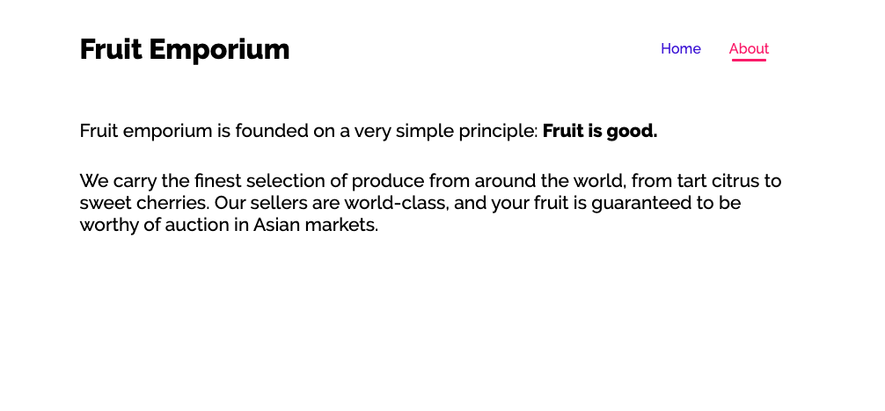
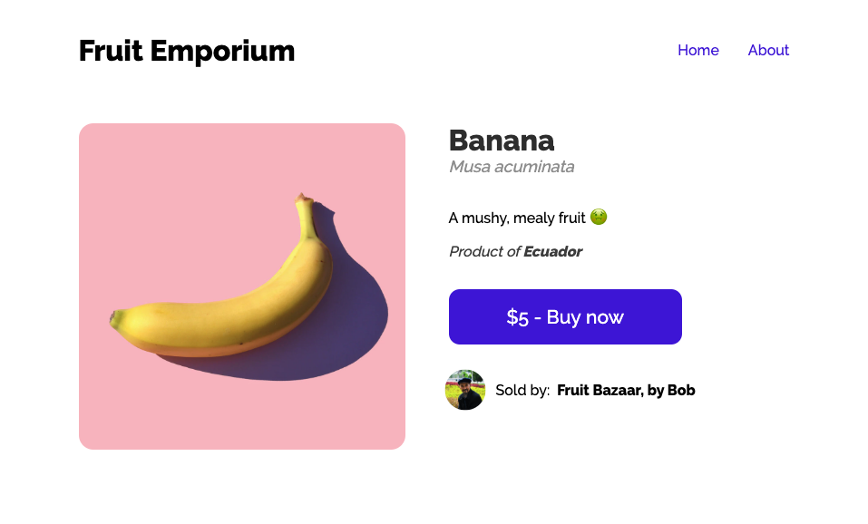
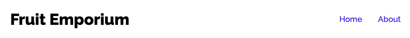
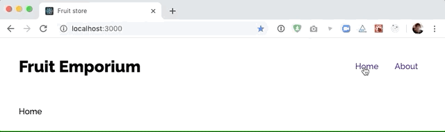
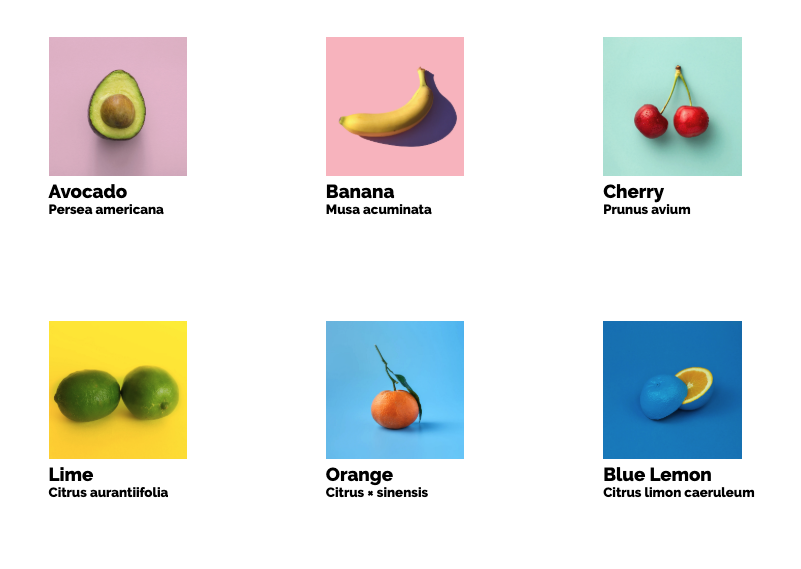
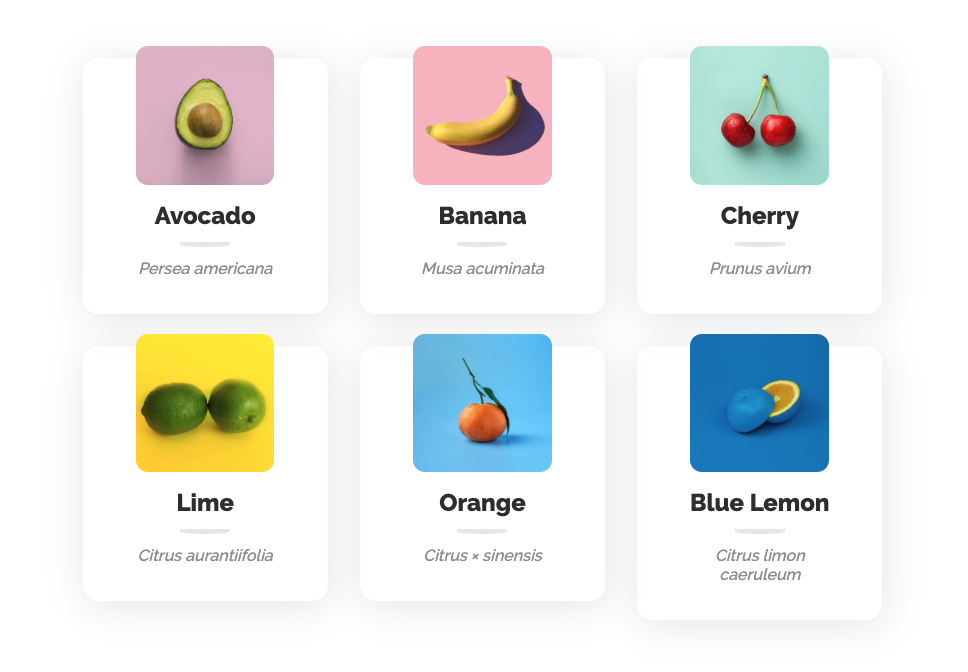
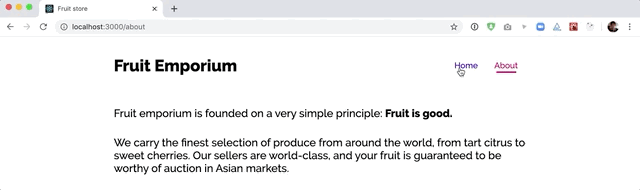

# 3-2 - The Fruit store

In this workshop, we'll build an online fruit store, with different items being sold by different sellers.

## Setup

Today's lecture introduced two new third-party dependencies: [`styled-components`](https://styled-components.com/) and [`react-router`](https://reactrouter.com/). Let's install both of them. Run the following command in the project directory:

`yarn add styled-components react-router-dom`

This project has very minimal scaffolding. We have a `data.js` with some items and sellers, and that's pretty much it.

---

## Our goal

We want to end up with the following routes:

- `/` - the homepage, with a listing of all store items
- `/about` - A page with some general information about the website
- `/items/:itemId` - The details view for a single item

### Homepage:



### About page:



### Items page



---

## Exercises

### Exercise 1: Routes + links

In `App.js`, import `BrowserRouter`, `Switch`, and `Route`. Add all the routes listed above, and add some placeholder text as children.

For example:

```jsx
<Switch>
  <Route path="/">Homepage</Route>
  <Route path="/about">About</Route>
</Switch>
```

Create a new `Header` component, and render it _above_ the `<Switch>`.

The `Header` component should add the logo on the left, and navigation links on the right:



The links should use a `<Link>` component to link towards the relevant pages (also imported from `react-router-dom`).

You should use styled-components for all styling.

You should be able to click the links to update the text on the screen:



---

### Exercise 2: Render content in homepage and about

Create two new components, `Home` and `About` and render them for their respective routes:

```jsx
<Switch>
  <Route path="/">
    <Homepage />
  </Route>
  {/* same thing for About */}
</Switch>
```

For `About`, we can add the following copy, using paragraph tags:

```md
Fruit emporium is founded on a very simple principle: Fruit is good.

We carry the finest selection of produce from around the world, from tart citrus to sweet cherries. Our sellers are world-class, and your fruit is guaranteed to be worthy of auction in Asian markets.
```

For the `Home` component, add the following copy:

```
Fruit emporium sells the finest fruits from this world and beyond.

Browse items:
```

Below that, we'll want to render a list of items. We _could_ do it right within the `Home` component, but it would be nice for it to have its own component.

Create a new `ListingGrid` component. This component will take an array of store items, as props, and render the grid showing all the items the user can buy.

```js
const ListingGrid = ({ itemList }) => {
  return "Todo";
};

ListingGrid.propTypes = {
  itemList: PropTypes.arrayOf(
    PropTypes.shape({
      name: PropTypes.string.isRequired,
      latinName: PropTypes.string.isRequired,
      imageSrc: PropTypes.string.isRequired,
    })
  ).isRequired,
};
```

In `src/data.js`, we have a bunch of items we want to render:

```js
export const items = {
  a: {
    id: 'a',
    name: 'Avocado',
    latinName: 'Persea americana',
    description: 'Millenials like to put it on toast.',
    imageSrc: '/assets/avocado.jpg',
    countryOfOrigin: 'Mexico',
    sellerId: 'alice',
    price: 8,
    quantity: 2,
  },
  ...
};
```

We can import this data into our `Home` component, turn it into an array (hint: `Object.values` could help!), and pass it as a prop to ListingGrid.

Inside `ListingGrid`, we'll want to map over this array, and produce some UI for each element of the array. In the screenshot, quite a bit of styling is applied, but you can feel free to style this however you want. The only requirements are that you render the image, the item name, and the item latin name:




> Hint: To arrange things in a grid, you can either give each one a specific width and use `display: inline-block` to stack them side-by-side. You can also use CSS grid, by using `auto-fit` and `minmax`.

### Exercise 3: Dynamic paths and item details

The items in our `ListingGrid` component should link to a new "item details" page:


Here are the steps we'll need to take:

- Create a new component, `ItemDetails`. It shouldn't take any props.
- Create a new route for the path `/items/:itemId`. Render the `ItemDetails` component.
- Import `Link` and link to these new pages. The URL can be constructed using the item's ID, for example: `/items/${item.id}`.
- Pull the data for this specific item.

That last step relies on the `useParams` hook, from react-router-dom. We can access the `itemId` URL parameter like so:

```js
import { useParams } from "react-router-dom";

const ItemDetails = () => {
  const { itemId } = useParams();
};
```

Next, we'll need to use that itemId to access the underlying item data (the product name, its price, etc).

In our new `ItemDetails` component, import `items` from `src/data.js`, and use the `itemId` to look up the data.

> NOTE: In a real application, we wouldn't have an `src/data.js` file. Instead, we'd request the data from a server. For now, we'll import from a static data file, but in future workshops and projects, we'll pull from a backend.

Render the item details. Use `styled-components` for all styling. It's up to you to choose whether you stick to the mockup exactly, or whether you add your own details. For reference, here's an example mockup:


Here are the requirements:

- Large photo of the item
- Name, latinName, description, countryOfOrigin shown in some way
- _if_ the item is in stock, show a "Buy now" button. Otherwise, render the text "out of stock".
- Show the avatar and store name of the seller. Hint: You'll need to import `sellers`.

---

<center>🟡 - Minimally complete workshop (75%) - 🟡</center>

---

### Exercise 4: Use `NavLink`

React router comes with a special variant of Link called NavLink. The difference is that it can tell whether it's linking to the current page.

Here's the documentation for this component: https://reacttraining.com/react-router/web/api/NavLink

Use this component to add a little underline + color change for the active link.



---

<center>🟢 - Complete workshop (100%) - 🟢</center>

---

### Stretch goal: Create "sellers" list and detail pages

Add a new route at `/sellers`. It should list the available sellers.

Add another new route, at `/sellers/:sellerId`. This should seem very much like the `/items/:itemId` route. This page should list basic information about the seller, plus a list of all of the seller's items.

You can reuse `ListingGrid` on the `/sellers/:sellerId` page, to render all of the sellers' items. You'll need to filter out the items based on the item's `sellerId`.

The presentation of these pages is left entirely up to you. The only rule is that you have to use styled-components for styling.

Have fun!
